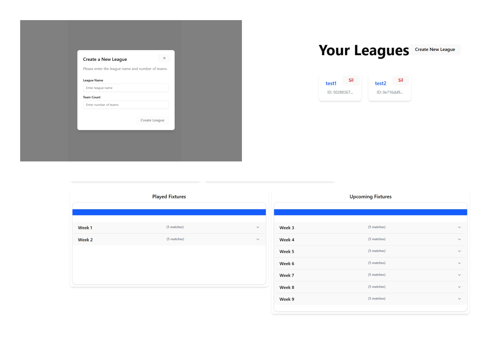
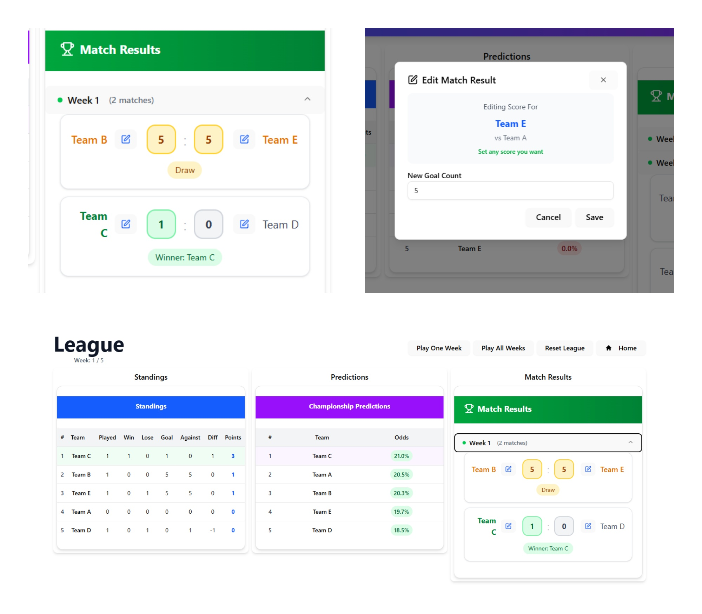

# Insider League Simulator ⚽

A football league simulation system built in Go, using a round-robin fixture algorithm. Users can create leagues, simulate matches, receive championship predictions, and edit results. All data is persisted in a MySQL database—no in-memory caching is used.

> The project includes a fully integrated AI-assisted frontend, while all API logic and integration was hand-crafted.

---

## 🎯 Purpose

This project was created to explore context-based state management, dependency injection (DI), and modular service architecture in Go. Although the database schema could be more optimized, the system is fully functional and under active improvement—especially around a better AppContext structure.

---

## 🚀 Features

- [x] Create leagues with custom team names
- [x] Round-robin fixture generation
- [x] Play matches and update results
- [x] Generate championship predictions
- [x] Resume existing leagues
- [x] All state stored as JSON fields in MySQL
- [x] 10 total API endpoints (5 GET, 3 POST, 1 PUT, 1 DELETE)
- [x] 75%+ unit test coverage (AI-assisted)
- [x] Dockerfile + docker-compose for deployment
- [x] Postman collection & environment files

---

## 🗂️ Project Structure

```
insider-league-sim/
├── backend/
│   ├── internal/
│   │   ├── appcontext/
│   │   ├── generator/
│   │   ├── league/
│   │   ├── predictor/
│   │   ├── repository/
│   │   └── simulation/
│   ├── api/
│   ├── config/
│   ├── main.go
│   └── go.mod/go.sum
├── frontend/
├── postman_collection/
├── Dockerfile
├── docker-compose.yml
└── README.md
```

---

## 🗃️ Database Schema (MySQL)

All data is stored in a schema called `league_sim`.

### `league` table
- `id`, `name`, `leagueId`, `createdAt`

### `active_league` table
- JSON fields for: `teams`, `fixtures`, `standings`, `currentWeek`

### `match_results` table
- All match outcomes and metadata

---

## 🔮 Prediction Algorithm

Each team's chance to win is calculated based on:
- 40% previous match performance
- 60% weighted sum of team stats (power, morale, stamina, defense)

---
### 🧭 User Flow

When a user visits the site, the first step is to create a league. They must provide a league name and the number of teams they want to include. If an odd number of teams is entered, the backend automatically adds a "bye" team to ensure fair match scheduling via a round-robin system.

Once the league is created, the user can navigate to the league interface. This view includes:

- A live **scoreboard**
- A list of **upcoming** and **played fixtures**
- A **prediction table** that shows the probability of each team becoming champion
- A list of **match results**

Users can choose to simulate a single match week or play out the entire league at once. The probability of winning is calculated based on each team's stats. Every team is randomly assigned attributes ranging between 70 and 100 at the time of league creation. Each attribute has a multiplier, and the outcome is decided using weighted randomness. There is also a 20% base chance that a match may end in a draw.

Match results can be edited later, but with a strict rule:
- In win/loss scenarios, **only the losing team can be made the winner**.
- In draw scenarios, **only one of the teams can be declared the winner**.
- **Editing goals is allowed**.

Predictions are recalculated after every simulation or manual result change. The chances of winning the league are based on a team’s current points and its overall strength. If a team mathematically cannot catch the leader in the remaining matches, its winning chance drops to 0%. In the final week, a winner is declared with a 100% chance. In case of a tie in points, the goal difference is used as a tiebreaker.

At any point, users can reset the league or force a winner if desired. Leagues are persistent: unless deleted, they remain stored and can be resumed exactly where they were left off.

---

## 🧪 Testing

- 85% unit test coverage
- AI used to assist in writing test logic
- Key services like Predictor, League, and Simulation are mocked and tested

---

## 📬 API Summary

10 endpoints:
- 5 GET
- 3 POST
- 1 PUT
- 1 DELETE

Each frontend component triggers its own request (modular architecture).  
[Postman collection](./postman%20collection) auto-updates the league ID after creation.

---

## 🖥️ Frontend

The frontend is AI-generated and fully integrated with the API.  
Users can create leagues, simulate matches, and view predictions through the UI.

---

## 🌐 Live Deployment

The project is deployed on a self-hosted Raspberry Pi using Coolify.  
Cloudflare Tunnel is used for public access via HTTP.

🌍 Live Demo: [http://iboio.kilicstation.com](http://iboio.kilicstation.com)

---

## 🧠 Notes & Reflections

- ✅ Favorite part: AppContext via interface and DI, familiar thanks to my NestJS experience
- ⚠️ Biggest challenge: Understanding and implementing the context interface
- ❌ Weakest link: The database schema—JSON fields could be normalized or simplified

---

## 🛠️ Future Plans

- Restructure AppContext with a cleaner dependency graph
- Refactor and normalize database design
- (Optional) Add Redis for faster cache-based access

---

## 📦 Setup

```bash
git clone https://github.com/iboio/insider-league-sim.git
cd insider-league-sim
docker-compose up --build
```

> Make sure to adjust the `.env` file in the `backend/` folder to match your local setup.
---
## ScreenShots
Login Page - Create New League - Fixtures Tables


Standings - Predictions - Match Results - Edit Results


---

## 📄 License

MIT

For more information → [GitHub: iboio/insider-league-sim](https://github.com/iboio/insider-league-sim)